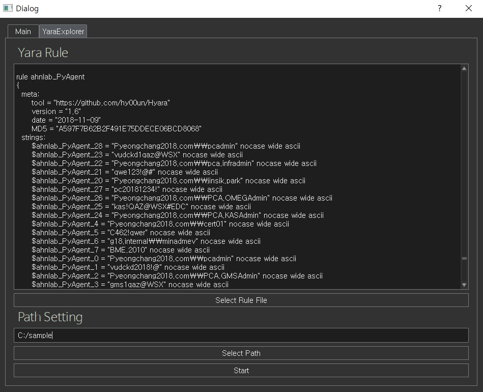
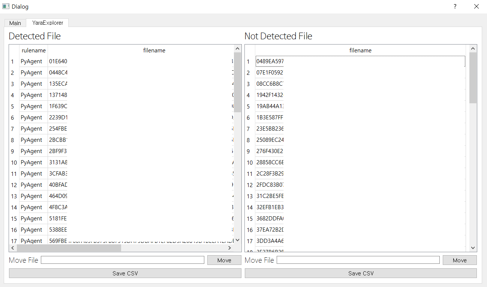

## YaraExplorer

## Install

pip instlal PyQt5

pip install yara-python

pip install qdarkgraystyle

pip install graphviz

## TODO

Drag & Drop File

~~PyQt Theme~~

~~Simple Visualization (graphviz)~~